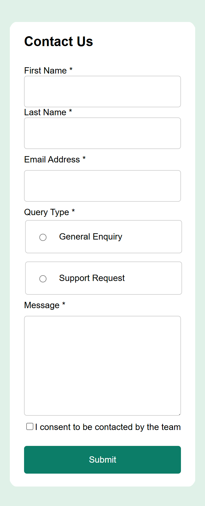
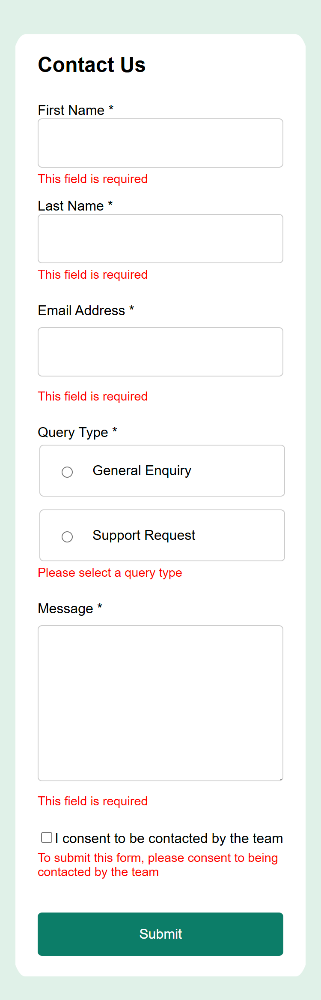
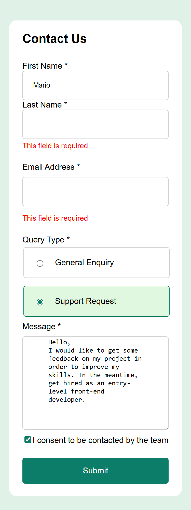
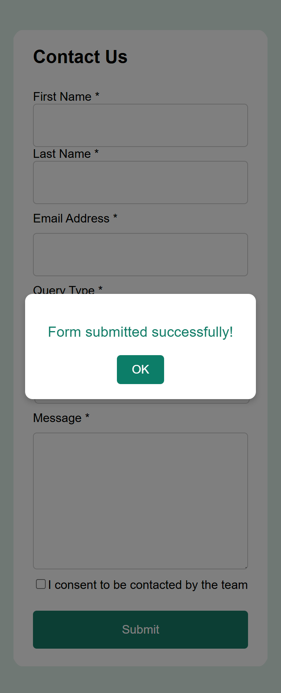
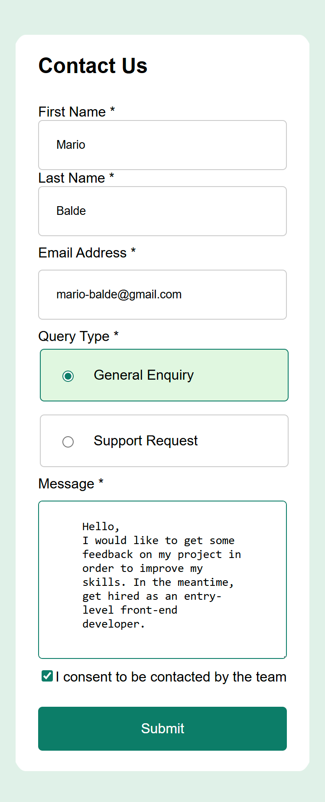
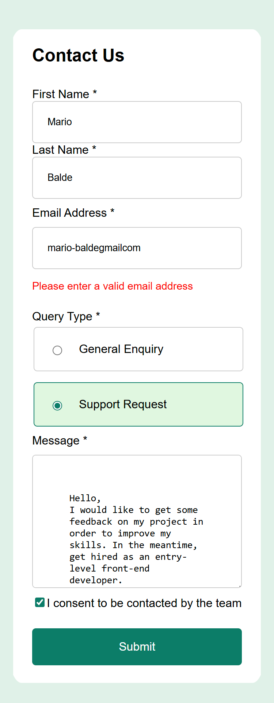
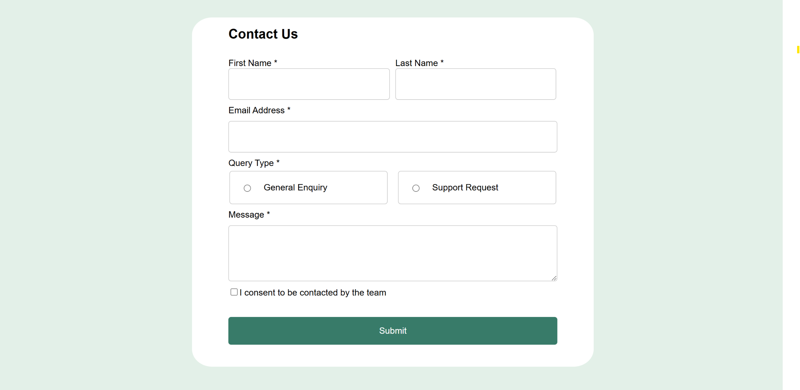
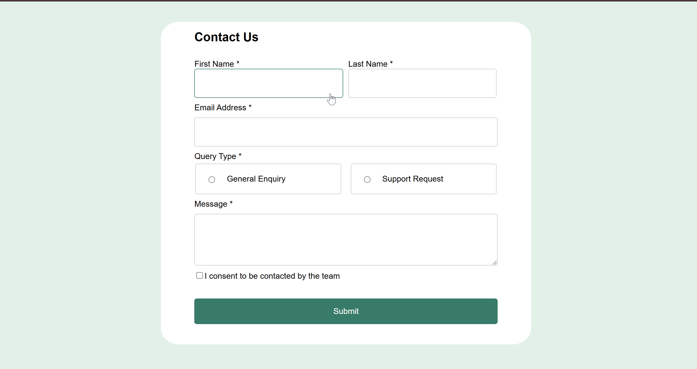
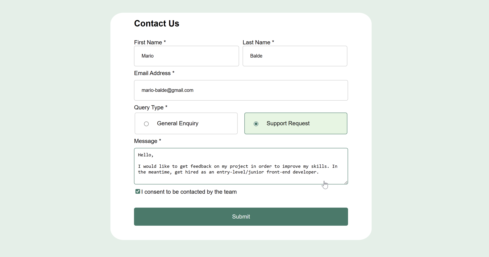
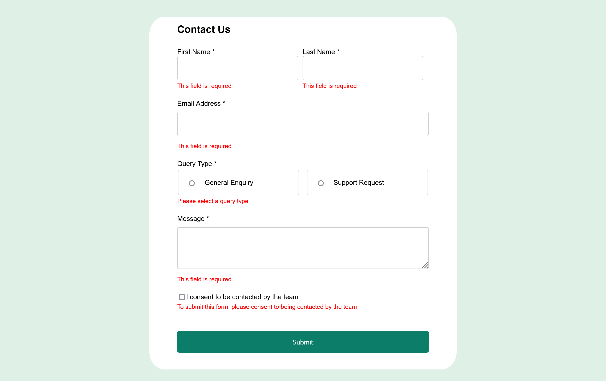

# Frontend Mentor - Contact form solution

This is a solution to the [Contact form challenge on Frontend Mentor](https://www.frontendmentor.io/challenges/contact-form--G-hYlqKJj). Frontend Mentor challenges help you improve your coding skills by building realistic projects. 

## Table of contents

- [Overview](#overview)
  - [The challenge](#the-challenge)
  - [Screenshot](#screenshot-Solution)
  - [Links](#links)
- [My process](#my-process)
  - [Built with](#built-with)
  - [What I learned](#what-i-learned)
  - [Continued development](#continued-development)
  - [Useful resources](#useful-resources)
- [Author](#author)
- [Acknowledgments](#acknowledgments)


## Overview
This is a responsive design form validation project focused on mobile-first design. In the "Mobile design", all the fields were set to stay in columns, rather than rows. However, as a responsive design project, the form was set to change its layout on desktop devices between "1200px to 3168px". The project uses "Media Queries" to achieve this functionality. 
Therefore, on the desktop screens between "1200px to 3168px", the form layout changes ("First Name", "Last Name", General Enquiry", and "Support Request" change from columns to rows, while the rest of the fields, such as "Email Address", "Message", and "Submit button" expand their width to align).

### The challenge

Users should be able to:

- Complete the form and see a success toast message upon successful submission
- Receive form validation messages if:
  - A required field has been missed
  - The email address is not formatted correctly
- Complete the form only using their keyboard
- Have inputs, error messages, and the success message announced on their screen reader
- View the optimal layout for the interface depending on their device's screen size
- See hover and focus states for all interactive elements on the page

### Screenshot Solution

---------Mobile-first-solution----------------------------------------------------------------------------------








--------Desktop Solution----------------------------------------------------------------------------------------






### Links

- Solution URL: [Add solution URL here](https://your-solution-url.com)
- Live Site URL: [Add live site URL here](https://your-live-site-url.com)

## My process


### Built with

- Standard Built-in HTML Elements (<form>, <input>, <textarea>, <fieldset>, <button>,)
- CSS 
- Flexbox
- Mobile-first workflow
- [React](https://reactjs.org/) - JS library


### What I learned

Use this section to recap over some of your major learnings while working through this project. Writing these out and providing code samples of areas you want to highlight is a great way to reinforce your own knowledge.

Throughout this form validation project, I had opportunity to apply my React theorical knowledge into practice, such as State Management (useState, formData, errors), Event Handling (onChange, onSubmit,), Conditional Rendering (Render error messages, and the success modal dynamically based on the state). In the meantime, I learned how to implement the "Modal Open" React State with CSS for centering and styling the "Modal".

Code snippets:

```React.js
const [successMessage, setSuccessMessage] = useState('');
    const [modalOpen, setModalOpen] = useState(false);
    console.log("I'm proud of this")

```
```JS
const handleChange = (e) => {
   console.log("I'm proud of this");
    };
```
```JS
const handleSubmit = (e) => {
  console.log("I'm proud of this");
  };
```

```css
.proud-of-this-css {
  .modal button 
    padding: 10px 20px;
    font-size: 1em;
    color: white;
    background-color: hsl(169, 82%, 27%);
    border: none;
    border-radius: 5px;
    cursor: pointer;
}
```

```css
.proud-of-this-css {
.error 
    color: red;
    font-size: 0.9em;
    margin-top: 5px;
}
```

```css
.proud-of-this-css {

@media (min-width: 1200px) and (max-width: 3168px) 

}
```

### Continued development

Use this section to outline areas that you want to continue focusing on in future projects. These could be concepts you're still not completely comfortable with or techniques you found useful that you want to refine and perfect.

Areas of focus/improvements:
REACT: 
------"State Managemnet": useState, formData, erros, etc.
------"Event Handling": like "onChange" and "onSubmit" to handle user inputs and form submissions.
------"Conditional Rendering": Rendering error messages and the success modal dynamically based on the state. 

CCS: Flexbox, Media Query.


### Useful resources

[React](https://reactjs.org/) - JS library: This helped me to understand React features (State Managemnet, Event Handling, Conditional Rendering, etc). 

[MDN](https://developer.mozilla.org/en-US/docs/Learn/CSS/CSS_layout/Flexbox) - To learn "Flexbox". This website impoved my undersatnding of "Flexbox", such as flex direction.

[MDN](https://developer.mozilla.org/en-US/docs/Web/CSS/@media#media_types) - Through this link, I learned "Media Query" quickly. In the meantime, it helped me to implement reponsive design faster. 


## Author

- Frontend Mentor - [@Mario-Balde](https://www.frontendmentor.io/profile/Mario-Balde)
- Linkdin - [@Mario-Balde](https://www.linkedin.com/in/mario-balde-44b994b5)

## Acknowledgments

I'd like to thank "Frontend Mentor" for providing this amazing challenge to test and beef up my skills. 
Though the design folder provided with the images, I was able to understand the project requirements and then built the form to look as closely as possible to the design. 

